<div align="center">

# 🖨️ 3D Agent MCP

**Text → 2D Preview → 3D Model → Print-Ready STL**

AI-powered multi-agent pipeline for generating 3D printable models from text descriptions, with MCP server for seamless AI assistant integration.

[](https://python.org)
[](LICENSE)
[](https://modelcontextprotocol.io)
[](https://gradio.app)
[](https://docker.com)
[](https://github.com/microsoft/autogen)
[](https://github.com/teslaproduuction/3d-agent-mcp/pkgs/container/3d-agent-mcp)

🇬🇧 English | [🇷🇺 Русский](README.ru.md)

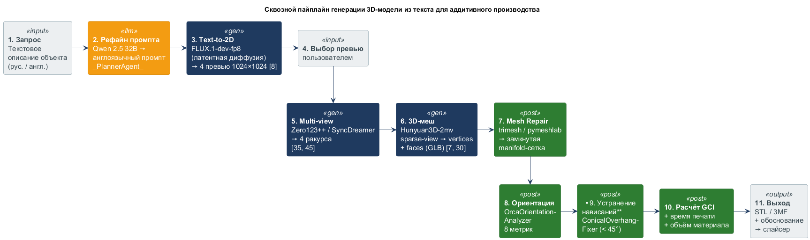

</div>

---

## Demo

<video src="https://github.com/teslaproduuction/3d-agent-mcp/raw/main/docs/demo.mp4" controls width="100%"></video>

### Generated Examples

<table>
  <tr>
    <td>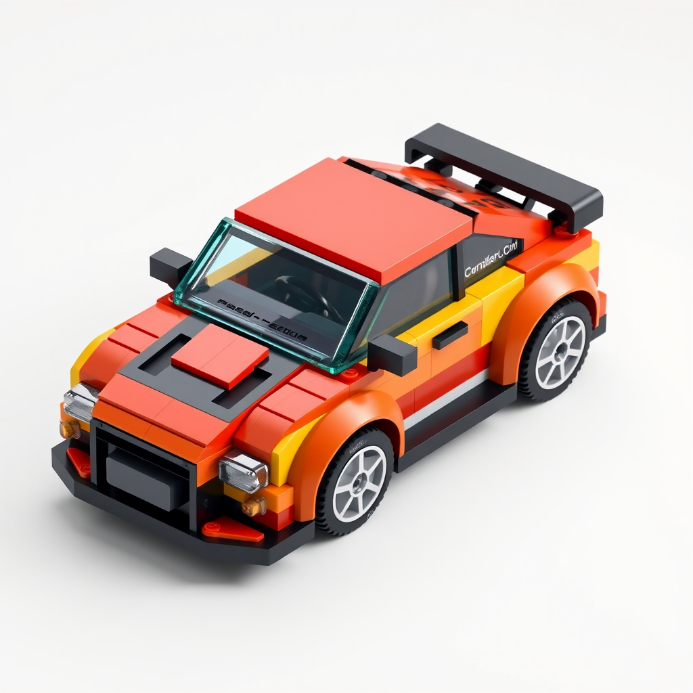</td>
    <td></td>
    <td>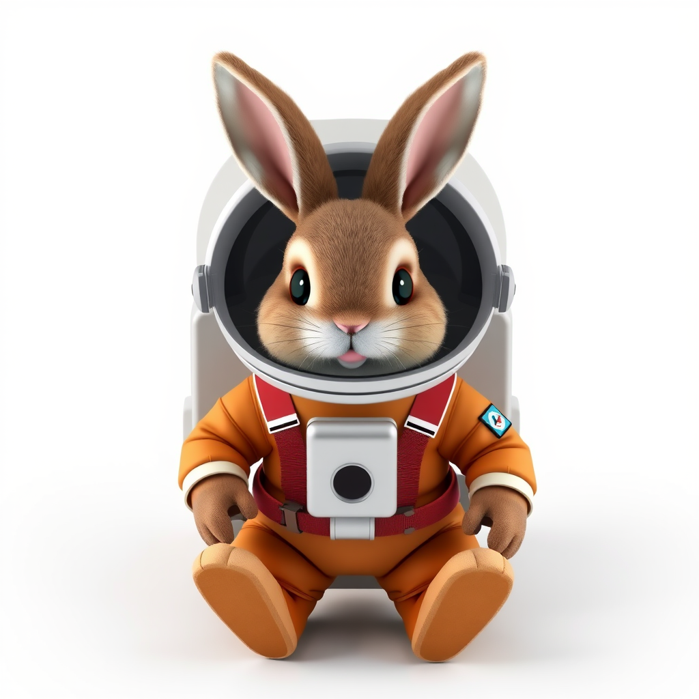</td>
    <td>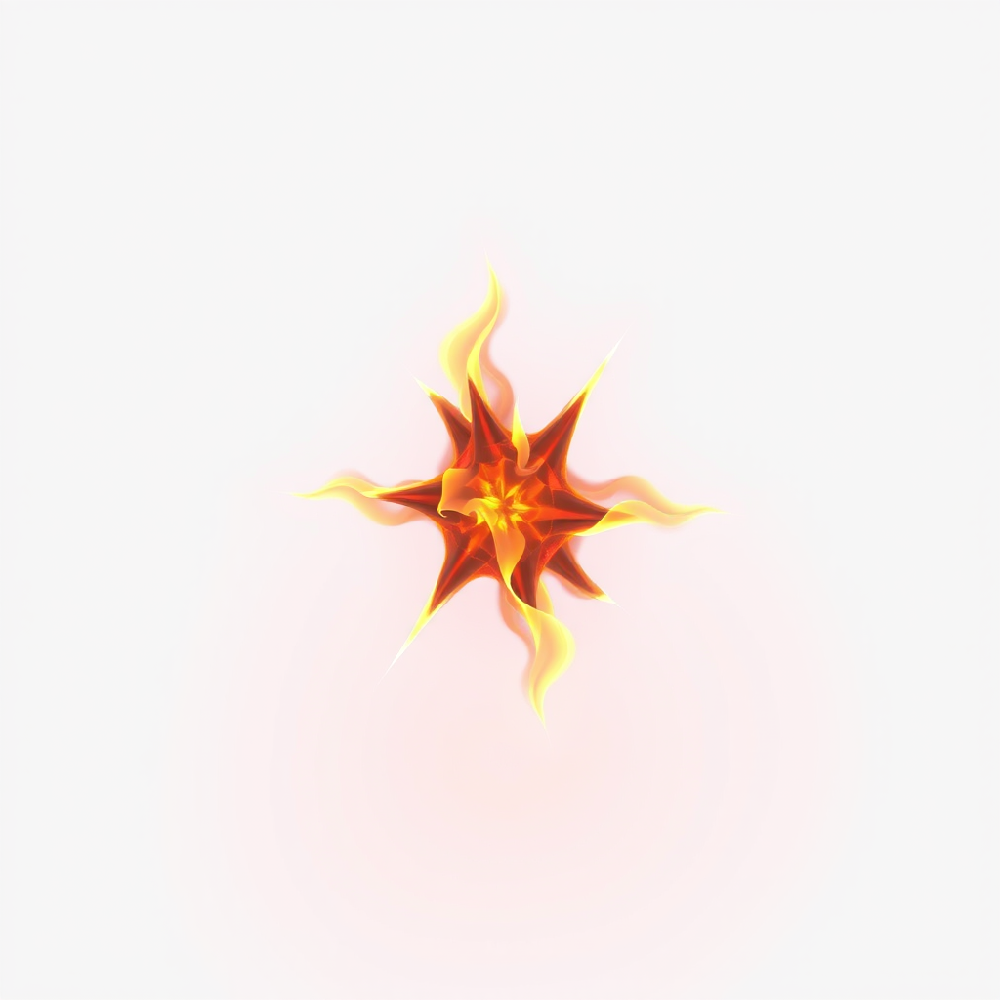</td>
  </tr>
  <tr>
    <td></td>
    <td></td>
    <td>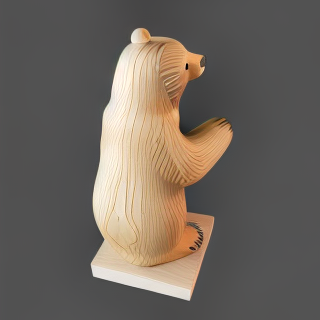</td>
    <td>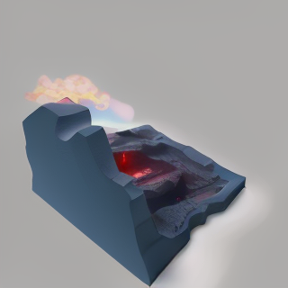</td>
  </tr>
</table>

*2D previews generated before 3D conversion — faster iteration, less API cost*

### Multi-View Generation

<table>
  <tr>
    <td>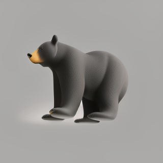</td>
    <td>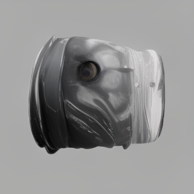</td>
    <td></td>
    <td>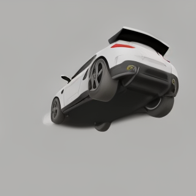</td>
    <td>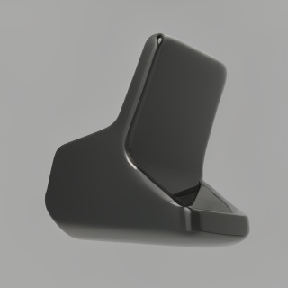</td>
  </tr>
</table>

*Multiple camera angles → higher-quality 3D geometry via Hunyuan3D-2mv*

---

## Architecture

### System Context (C4 Level 1)

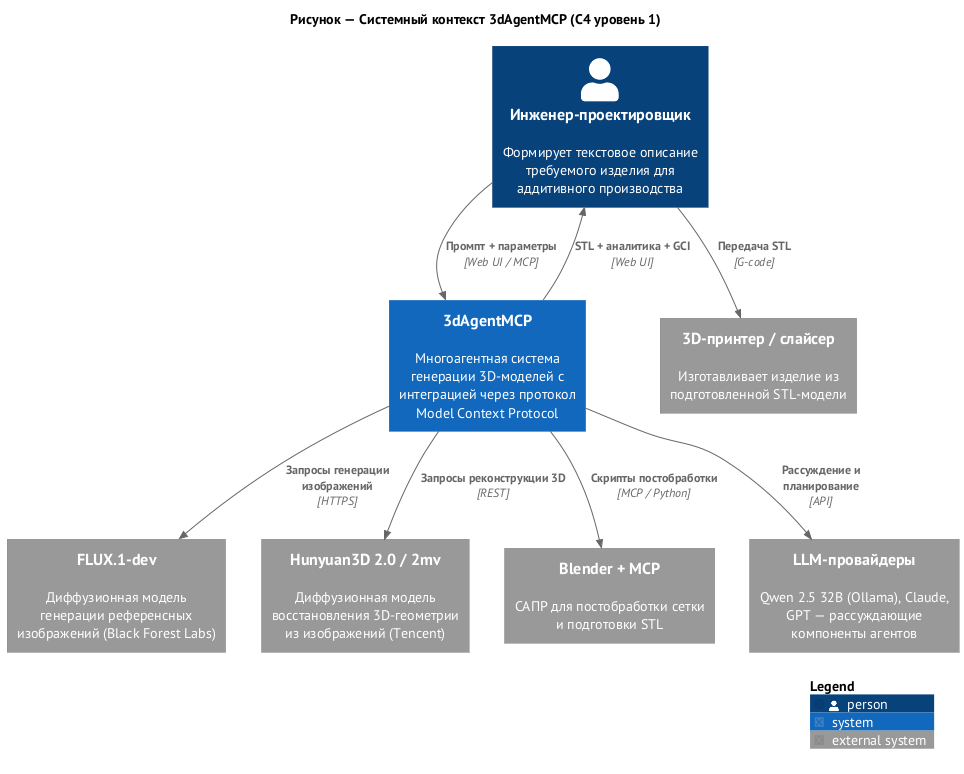

### Containers (C4 Level 2)

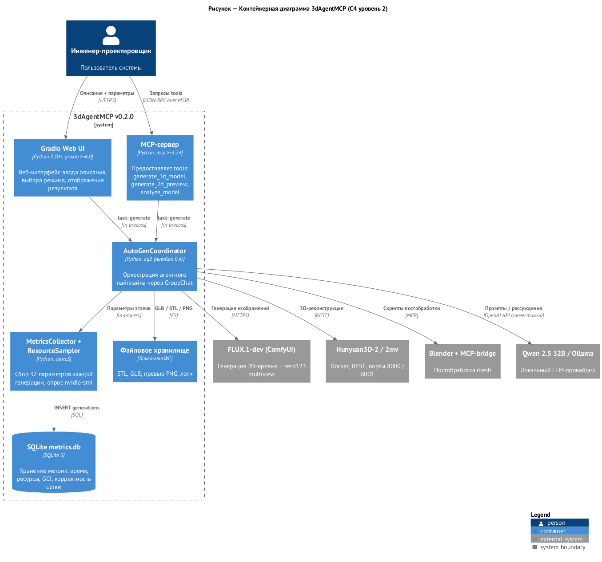

### Agent Pipeline

```
User Prompt
    │
    ▼
┌─────────────────────┐
│    Planner Agent    │  ← Decomposes prompt into objects
└─────────┬───────────┘
          │
          ▼
┌─────────────────────┐
│  Image Gen Agent    │  ← DALL-E 3 / FLUX / Qwen (2D preview)
└─────────┬───────────┘
          │
    [User confirms preview]
          │
          ▼
┌─────────────────────┐
│  Generation Agent   │  ← Tripo3D API / Hunyuan3D (local)
└─────────┬───────────┘
          │
          ▼
┌─────────────────────────────────────┐
│  Intelligent PostProcessing Agent   │
│  ├── Overhang analysis (24 angles)  │
│  ├── Support strategy decision      │
│  └── Optimal orientation on bed     │
└─────────┬───────────────────────────┘
          │
          ▼
    Print-Ready STL
```

### Technical Stack

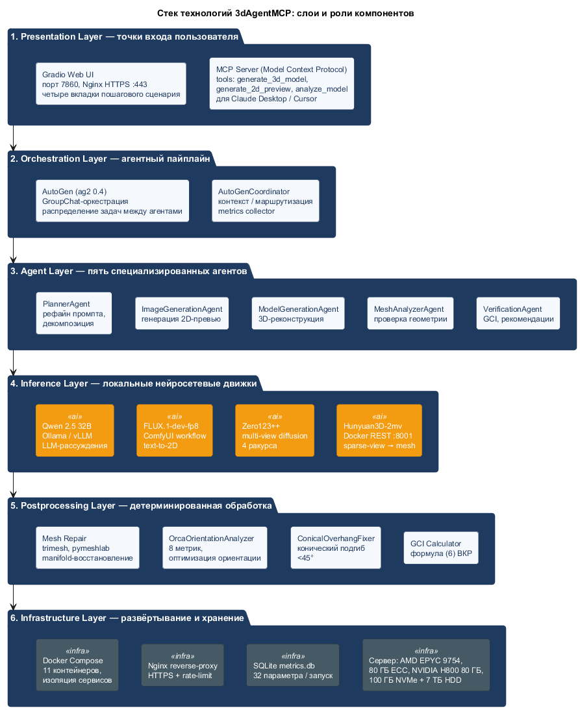

---

## Features

| Feature | Description |
|---|---|
| **Text-to-3D** | Generate 3D model from any text description |
| **2D Preview gate** | Create image preview before expensive 3D API call |
| **Intelligent post-processing** | AI agent analyzes geometry, decides supports and orientation |
| **Multi-view generation** | Multiple camera angles → better 3D quality |
| **Multi-object scenes** | Plan and generate complex scenes with multiple objects |
| **MCP integration** | Use from Claude Desktop, Cursor, and any MCP client |
| **Local models** | Hunyuan3D-2, TripoSR, FLUX — no API costs, runs on-premise |
| **Docker stack** | Full local stack with GPU support |

### Intelligent Post-Processing Output

```
desk_organizer analysis:

✅ Printable without supports in recommended orientation.

Complexity: EASY

AI Analysis:
  - Geometry complexity: MEDIUM
  - Max overhang angle: 38.5°
  - Bed contact area: 1 250 mm²
  - No internal cavities detected
  - Recommended: rotate 180° around X axis
```

---

## Quick Start

### Option 0 — Docker image (fastest)

```bash
docker pull ghcr.io/teslaproduuction/3d-agent-mcp:latest

cp .env.example .env
# Fill in API keys

docker-compose up -d
# → http://localhost:7860
```

### Option 1 — UV (recommended, 10–100× faster than pip)

```bash
# Install UV
winget install --id=astral-sh.uv -e        # Windows
curl -LsSf https://astral.sh/uv/install.sh | sh  # Linux/macOS

# Clone and setup
git clone https://github.com/teslaproduuction/3d-agent-mcp.git
cd 3d-agent-mcp
uv venv --python 3.10
uv sync --all-extras

# Configure
cp .env.example .env
# Edit .env with your API keys

# Run
uv run python ui/gradio_app.py
# → http://localhost:7860
```

### Option 2 — Docker (full stack with local models)

```bash
cp .env.example .env
# Edit .env

docker-compose up -d --build
# → http://localhost
```

### Option 3 — pip

```bash
python -m venv .venv
source .venv/bin/activate      # Linux/macOS
.venv\Scripts\activate         # Windows

pip install -r requirements.txt
cp .env.example .env
python ui/gradio_app.py        # → http://localhost:7860
```

---

## MCP Integration

Works with **Claude Desktop**, **Cursor**, **Windsurf**, and any MCP-compatible client.

### Claude Desktop config (`claude_desktop_config.json`)

```json
{
  "mcpServers": {
    "3d-agent": {
      "command": "python",
      "args": ["/path/to/3d-agent-mcp/mcp_server/server.py"],
      "env": {
        "TRIPO_API_KEY": "your_key",
        "OPENAI_API_KEY": "your_key"
      }
    }
  }
}
```

### Usage in Claude

```
User: Generate a phone stand for 3D printing

Claude: [calls generate_3d_model tool]
✅ Model generated and optimized for printing!
   - File: outputs/models/phone_stand_optimized.stl
   - Supports: none required
   - Orientation: base-down
   - Print time: ~2h 15min
```

**Available MCP tools:** `generate_3d_model` · `generate_2d_preview` · `analyze_printability` · `plan_scene`

→ See [mcp_server/README.md](mcp_server/README.md) for full API docs.

---

## API Keys

| Key | Purpose | Required |
|---|---|---|
| `OPENAI_API_KEY` | DALL-E 3 image gen + GPT for agents | For cloud mode |
| `TRIPO_API_KEY` | 3D generation (Tripo3D cloud) | For cloud mode |
| `ANTHROPIC_API_KEY` | Claude models as agent LLM | Optional |
| `REPLICATE_API_TOKEN` | SDXL / Flux image generation | Optional |

> **No cloud keys needed for local mode** — run Hunyuan3D + FLUX via Docker stack.

---

## Configuration

`config.yaml` controls all behavior:

```yaml
default_settings:
  # Image generation
  image_generation:
    provider: "local"     # local | dalle3 | sdxl | flux

  # 3D generation
  generation:
    api_provider: "local" # local | tripo | meshy
    face_limit: 10000

  # Post-processing
  postprocessing:
    mode: "intelligent"   # AI decides automatically
    auto_orient: true
    max_overhang_angle: 45.0

  # Printer profile
  printer:
    build_volume: [220, 220, 250]  # mm — Ender 3 / Bambu A1
    nozzle_diameter: 0.4
    material: "PLA"

# LLM backend
llm:
  default_provider: "ollama"   # ollama | openai | anthropic
  local:
    ollama_models: ["qwen2.5:32b", "qwen2.5:7b"]
```

---

## Project Structure

```
3d-agent-mcp/
├── agents/                              # AI agents
│   ├── coordinator.py                   # Pipeline orchestrator
│   ├── planner_agent.py                 # Scene decomposition
│   ├── image_generation_agent.py        # 2D preview
│   ├── generation_agent.py              # 3D API calls
│   └── intelligent_postprocessing_agent.py
│
├── api_clients/                         # API wrappers
│   ├── llm_client.py                    # OpenAI / Anthropic / Ollama
│   ├── image_api_client.py              # DALL-E / SDXL / FLUX
│   └── tripo_client.py                  # Tripo3D
│
├── mcp_server/                          # MCP server
│   ├── server.py                        # Tool definitions
│   └── README.md                        # MCP API docs
│
├── ui/                                  # Gradio web UI
│   ├── gradio_app.py                    # Main app
│   └── tabs/, handlers/, components/
│
├── postprocessing/                      # Geometry analysis
├── docker/                              # Local model containers
│   ├── hunyuan3d/                       # Hunyuan3D-2 (local 3D)
│   ├── flux/                            # FLUX.1 (local image gen)
│   ├── comfyui/                         # ComfyUI
│   └── nginx/                           # Reverse proxy
│
├── tests/
├── config.yaml                          # Main config
├── .env.example                         # API key template
├── docker-compose.yml                   # Full Docker stack
└── pyproject.toml
```

---

## Diagrams

| Diagram | File |
|---|---|
| Component | [docs/PR/diagrams/01_component.png](docs/PR/diagrams/01_component.png) |
| Sequence | [docs/PR/diagrams/02_sequence.png](docs/PR/diagrams/02_sequence.png) |
| Activity | [docs/PR/diagrams/03_activity_gci.png](docs/PR/diagrams/03_activity_gci.png) |
| Deployment | [docs/PR/diagrams/04_deployment.png](docs/PR/diagrams/04_deployment.png) |
| Classes | [docs/PR/diagrams/05_classes.png](docs/PR/diagrams/05_classes.png) |

---

## Development

```bash
# Run tests
pytest tests/

# Format
black .

# Lint
flake8 .

# Type check
mypy .
```

---

## Roadmap

- [ ] Meshy API integration
- [ ] PySLM — physics-based support generation
- [ ] G-code preview before printing
- [ ] Printer preset library (Ender 3, Bambu, Prusa)
- [ ] Export to OBJ, FBX, GLTF
- [ ] REST API mode (no Gradio dependency)

---

## Contributing

1. Fork the repo
2. Create a feature branch: `git checkout -b feature/my-feature`
3. Commit changes: `git commit -m "feat: add my feature"`
4. Push: `git push origin feature/my-feature`
5. Open a Pull Request

---

## License

MIT © 2026 — see [LICENSE](LICENSE)
