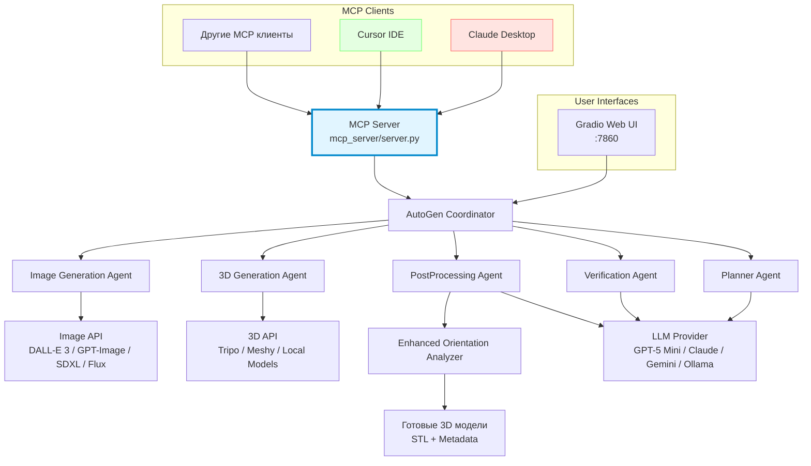
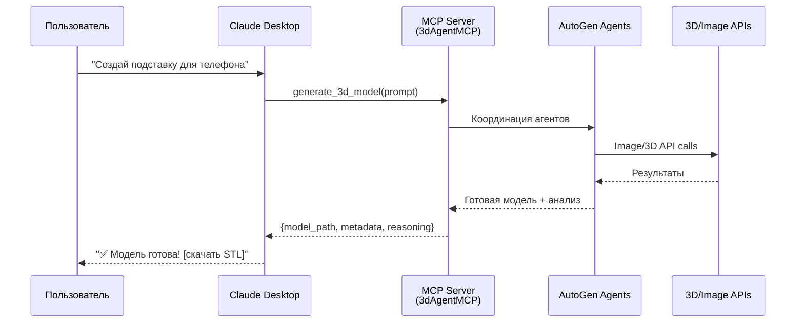
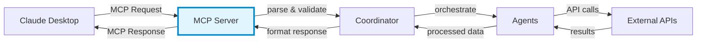
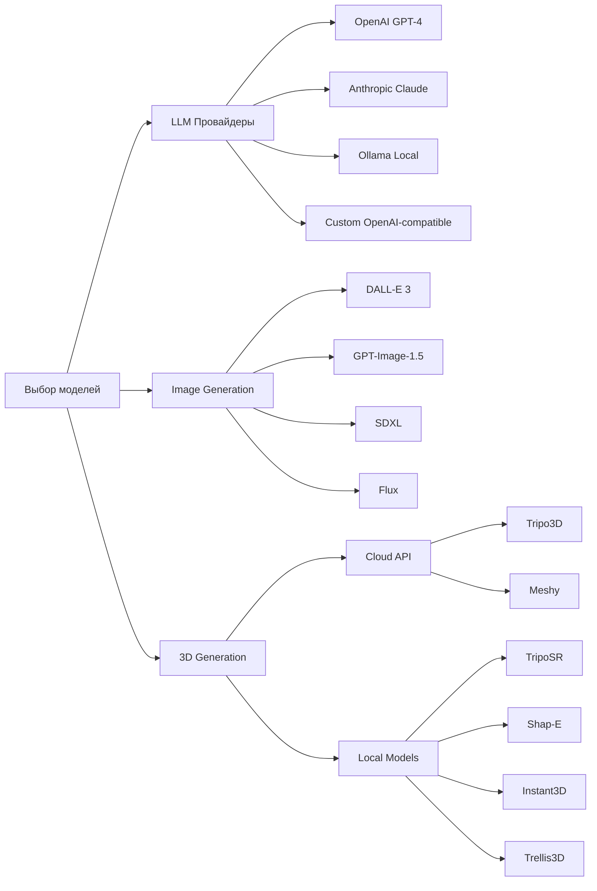
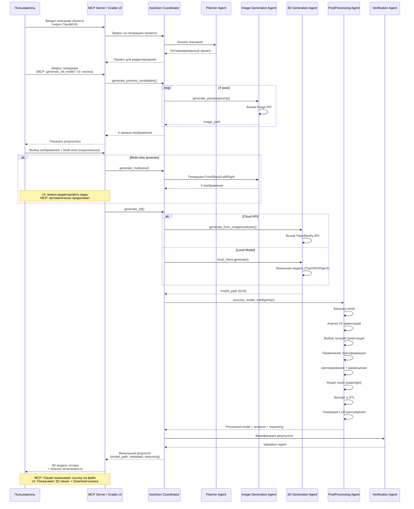
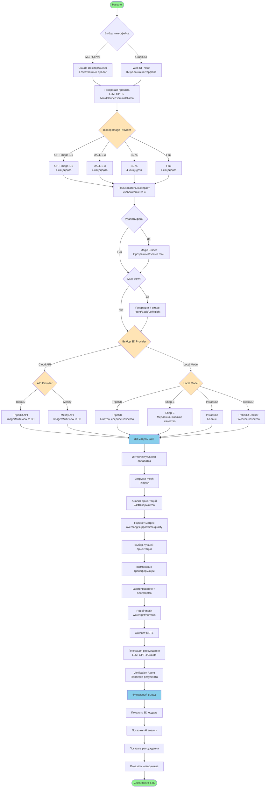
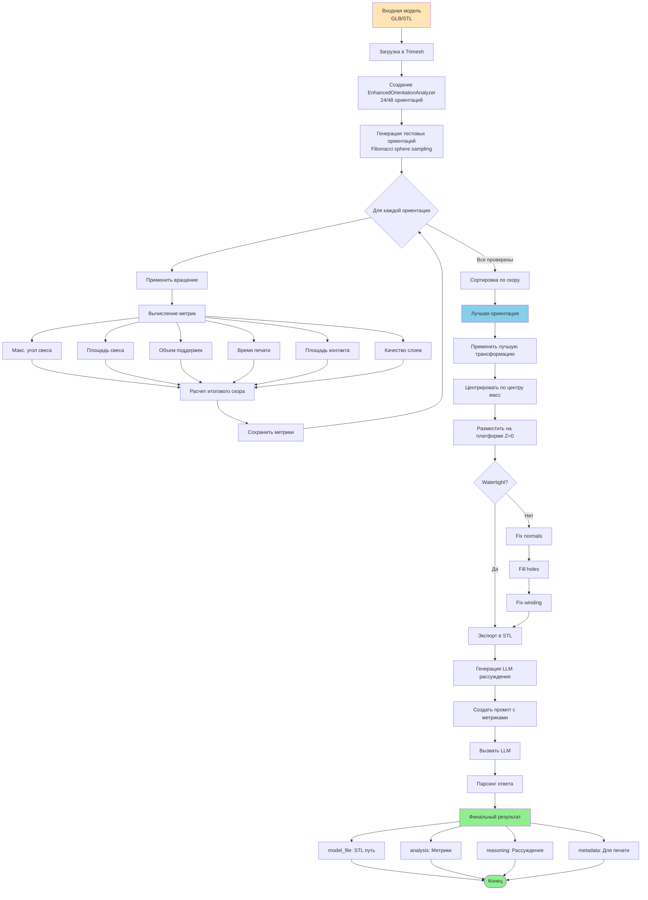
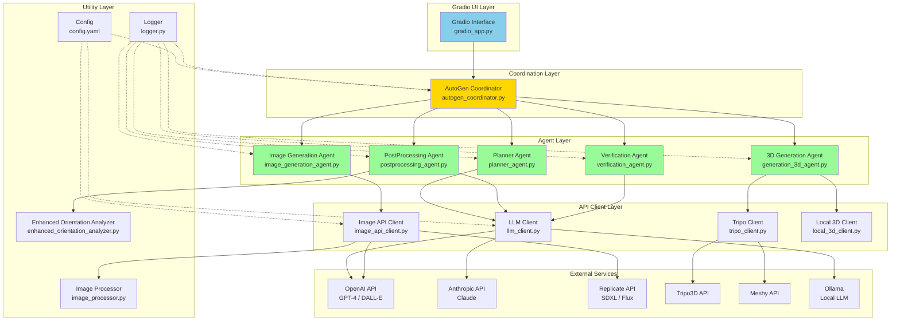

# Архитектура системы генерации 3D моделей

## Содержание

1. [Обзор системы](#обзор-системы)
2. [MCP Integration (Model Context Protocol)](#mcp-integration-model-context-protocol)
3. [Агентная архитектура](#агентная-архитектура)
4. [Точки выбора моделей](#точки-выбора-моделей)
5. [Пайплайн генерации](#пайплайн-генерации)
6. [Взаимодействие компонентов](#взаимодействие-компонентов)
7. [Конфигурация](#конфигурация)

---

## Обзор системы

Система представляет собой агентную платформу для генерации 3D моделей с использованием AI, построенную на базе **AutoGen Framework**. Система поддерживает полный цикл создания моделей от текстового описания до готовых к печати STL файлов.

**⚡ Интеграция через MCP (Model Context Protocol):** Система работает через **MCP сервер**, что позволяет использовать её из **Claude Desktop**, **Cursor IDE**, и других MCP-клиентов напрямую в диалоге!

### Ключевые возможности

- **MCP интеграция** - работает через Model Context Protocol для Claude Desktop/Cursor
- Генерация 2D превью с выбором из 4 кандидатов
- Multi-view генерация для улучшения качества 3D моделей
- Интеллектуальная оптимизация ориентации для 3D печати
- Поддержка облачных и локальных моделей
- Автоматический анализ печатаемости и генерация рекомендаций

### Режимы использования

1. **MCP Server** (рекомендуется) - через Claude Desktop, Cursor, другие MCP клиенты
2. **Gradio Web UI** - standalone веб-интерфейс на порту 7860
3. **Docker** - полный стек с локальными моделями

### Диаграмма высокоуровневой архитектуры



---

## MCP Integration (Model Context Protocol)

### Что такое MCP?

**Model Context Protocol (MCP)** - это открытый протокол от Anthropic для интеграции AI-ассистентов с внешними инструментами и сервисами. 3dAgentMCP реализует MCP сервер, позволяя использовать систему генерации 3D моделей прямо из Claude Desktop, Cursor IDE и других MCP-совместимых клиентов.

### Архитектура MCP интеграции



### MCP Server (`mcp_server/server.py`)

**Расположение:** `mcp_server/server.py`

**Предоставляемые инструменты:**

| Инструмент | Описание | Параметры |
|-----------|----------|-----------|
| `generate_3d_model` | Полная генерация 3D модели | `prompt`, `use_preview`, `provider` |
| `generate_preview` | Только 2D превью (4 варианта) | `prompt`, `style` |
| `analyze_model` | Анализ существующей модели | `model_path` |
| `list_models` | Список сгенерированных моделей | - |

### Пример использования в Claude Desktop

**Установка:**

```json
// ~/.config/claude-desktop/config.json
{
  "mcpServers": {
    "3d-agent": {
      "command": "python",
      "args": ["/path/to/3dAgentMCP/mcp_server/server.py"],
      "env": {
        "TRIPO_API_KEY": "your_key",
        "OPENAI_API_KEY": "your_key"
      }
    }
  }
}
```

**Использование:**

```
Пользователь: Создай 3D модель органайзера для стола с отделениями
              для ручек, скрепок и телефона

Claude: [Использует generate_3d_model tool]
        ✅ Модель успешно сгенерирована!

        📊 Анализ печатаемости:
        - Сложность: MEDIUM
        - Максимальный свес: 38.5°
        - Рекомендация: Печать без поддержек
        - Ориентация: Оптимизирована автоматически

        📥 Файл: outputs/models/desk_organizer_20250125_143022.stl

        Модель готова к 3D печати! Хотите внести изменения?
```

### Интеграция с Cursor IDE

Cursor IDE также поддерживает MCP. После настройки вы можете генерировать 3D модели прямо в процессе разработки:

```
В Cursor: "Generate a 3D printable phone stand"
→ 3D модель создается и сохраняется в проект
→ Код для загрузки модели автоматически добавляется
```

### Преимущества MCP подхода

✅ **Естественный диалог** - генерация 3D моделей через обычную беседу
✅ **Контекст разговора** - Claude помнит предыдущие модели и может итерировать
✅ **Автоматическая оптимизация** - Claude может запросить анализ и улучшить модель
✅ **Интеграция в workflow** - работает внутри Claude Desktop без переключения окон
✅ **Расширяемость** - легко добавить новые MCP tools для дополнительных функций

### Поток данных через MCP



### Доступные MCP эндпоинты

**1. generate_3d_model**

Полный пайплайн генерации:

```python
{
  "prompt": "desk organizer with phone stand",
  "use_preview": true,  # Генерировать 2D превью
  "provider": "tripo",  # tripo | meshy | local
  "style": "realistic",
  "enable_postprocessing": true
}
```

**2. generate_preview**

Только генерация превью (без 3D):

```python
{
  "prompt": "phone stand, minimalist design",
  "num_candidates": 4,
  "style": "product design"
}
```

**3. analyze_model**

Анализ печатаемости существующей модели:

```python
{
  "model_path": "path/to/model.stl"
}
```

### Логирование и мониторинг

MCP сервер логирует все операции:

```
[MCP] Request: generate_3d_model
[MCP] Prompt: desk organizer
[MCP] Starting agent coordination...
[MCP] Planner: Created plan with 1 object
[MCP] Image Agent: Generated 4 previews
[MCP] 3D Agent: Model generated via Tripo
[MCP] PostProcessing: Orientation optimized
[MCP] Response: Success (model_path: outputs/...)
```

**Логи сохраняются:** `outputs/logs/mcp_server.log`

### Безопасность

- API ключи передаются через переменные окружения (не в коде)
- Валидация всех входных параметров
- Ограничение размера файлов
- Песочница для выполнения кода (опционально)

---

## Агентная архитектура

Система использует **5 специализированных агентов**, координируемых через AutoGen GroupChat:

### 1. Planner Agent (`planner_agent.py`)

**Роль:** Анализ и декомпозиция пользовательских запросов

**Функции:**
- Разбивает сложные запросы на отдельные 3D объекты
- Создает детальные промпты для каждого объекта
- Определяет приоритеты генерации
- Валидирует план на печатаемость

**Пример выхода:**
```json
[
  {
    "object": "desk organizer base",
    "prompt": "rectangular desk organizer base with compartments...",
    "priority": 1,
    "quantity": 1
  }
]
```

**Расположение:** `agents/autogen/planner_agent.py:56`

---

### 2. Image Generation Agent (`image_generation_agent.py`)

**Роль:** Создание 2D превью изображений

**Функции:**
- Генерирует 4 варианта превью для выбора пользователем
- Поддерживает multi-view генерацию (front, back, left, right)
- Удаление фона (прозрачный или белый)
- Улучшение промптов для 3D стиля

**Поддерживаемые провайдеры:**
- **DALL-E 3** (OpenAI)
- **GPT-Image-1.5** (Edit API) - лучшая консистентность для multi-view
- **SDXL** (Replicate)
- **Flux** (Replicate)

**Расположение:** `agents/autogen/image_generation_agent.py:31`

---

### 3. 3D Generation Agent (`generation_3d_agent.py`)

**Роль:** Генерация 3D моделей

**Функции:**
- Text-to-3D генерация
- Image-to-3D генерация (лучшее качество)
- Multi-view-to-3D генерация
- Поддержка облачных и локальных моделей

**Режимы работы:**

#### API (Cloud):
- **Tripo3D** - быстрая генерация, высокое качество
- **Meshy** - альтернативный провайдер

#### Локальные модели:
- **TripoSR** - быстро, низкое качество
- **Shap-E** - медленно, высокое качество
- **Instant3D** - баланс скорости и качества
- **Trellis3D** - Docker container, высокое качество

**Расположение:** `agents/autogen/generation_3d_agent.py:32`

---

### 4. PostProcessing Agent (`postprocessing_agent.py`)

**Роль:** Оптимизация моделей для 3D печати

**Функции:**
- Анализ 24+ вариантов ориентации
- Оптимизация по метрикам:
  - Угол свеса (overhang angle)
  - Площадь свеса (overhang area)
  - Объем поддержек (support volume)
  - Время печати (print time)
  - Площадь контакта (contact area)
  - Качество слоев (layer quality)
- Автоматическое исправление геометрии (watertight)
- Центрирование и размещение на платформе

**Алгоритм оценки:**
```python
score = (
    overhang_angle * 10.0 +
    overhang_area * 1.0 +
    support_volume * 0.1 +
    print_time * 50.0 +
    contact_area * -0.5 +
    layer_quality * -100.0
)
```

**Расположение:** `agents/autogen/postprocessing_agent.py:38`

---

### 5. Verification Agent (`verification_agent.py`)

**Роль:** Проверка и валидация результатов

**Функции:**
- Проверка ориентации на корректность
- Валидация рекомендаций по поддержкам
- Генерация финального отчета
- Проверка соответствия требованиям принтера

**Расположение:** `agents/autogen/verification_agent.py`

---

## Точки выбора моделей

Система предоставляет гибкость в выборе моделей на разных этапах пайплайна.

### Диаграмма точек выбора



### 1. LLM Провайдеры (для агентов)

Конфигурируется в `config.yaml`:

```yaml
llm:
  default_provider: "openai"

  cloud:
    openai:
      enabled: true
      model: "gpt-4o-mini"  # 60% cheaper than GPT-3.5, faster than GPT-4
    anthropic:
      enabled: false
      model: "claude-3-5-sonnet-20241022"
    google:
      enabled: false
      model: "gemini-2.0-flash-exp"  # 33% cheaper than GPT-4o-mini

  local:
    enabled: false
    ollama_models: ["llama3.1", "mistral"]

  hybrid:
    enabled: false
    agent_models:
      planner: {provider: "openai", model: "gpt-4o-mini"}
      postprocessing: {provider: "openai", model: "gpt-4o"}
      verification: {provider: "anthropic", model: "claude-3-5-sonnet"}
      image_gen: {provider: "google", model: "gemini-2.0-flash-exp"}
```

**Сравнение LLM провайдеров (2025):**

| Модель | Цена (вход/выход за 1M токенов) | Скорость | Качество | Рекомендация |
|--------|--------------------------------|----------|----------|--------------|
| **🆕 GPT-5 Mini** | **$0.25 / $2.00** | ⚡⚡ Очень быстро | ⭐⭐⭐⭐⭐ Превосходно | **ЛУЧШИЙ ВЫБОР!** |
| 🆕 GPT-5 | $1.25 / $10.00 | ⚡⚡ Очень быстро | ⭐⭐⭐⭐⭐ State-of-the-art | Для сложных задач |
| 🆕 o3-mini | $0.25 / $2.00 | ⚡ Быстро | ⭐⭐⭐⭐⭐ Reasoning | Для STEM/анализа |
| GPT-4o-mini | $0.15 / $0.60 | ⚡ Быстро | ⭐⭐⭐⭐ Отлично | Хороший бюджетный |
| GPT-4o | $2.50 / $10.00 | ⚡ Быстро | ⭐⭐⭐⭐⭐ Превосходно | Дорогой |
| GPT-4 (legacy) | $30.00 / $60.00 | Медленно | ⭐⭐⭐⭐⭐ Превосходно | Устаревший |
| Claude 3.5 Sonnet | $3.00 / $15.00 | Средне | ⭐⭐⭐⭐⭐ Превосходно | Альтернатива |
| **Gemini 2.0 Flash** | **$0.10 / $0.40** | ⚡⚡⚡ Быстрейший | ⭐⭐⭐⭐ Хорошо | **Самый дешевый** |
| Llama 3.1 (Ollama) | $0 (локально) | Зависит от GPU | ⭐⭐⭐ Хорошо | Оффлайн |

### Новые модели OpenAI (2025)

**GPT-5** (релиз: 7 августа 2025):
- **GPT-5 Main**: State-of-the-art модель для общих задач и агентов
- **GPT-5 Mini**: Быстрая и доступная версия с отличным качеством
- **GPT-5 Nano**: Самая легкая версия
- Контекст: до 256,000 токенов
- Мультимодальный ввод (текст, изображения)
- AIME 2025: 94.6% точность
- SWE-bench Verified: 74.9%

**O-Series** (reasoning models):
- **o3-mini** (релиз: 31 января 2025): Оптимизирован для STEM и кодирования
- **o4-mini** (релиз: 16 апреля 2025): Лучшая производительность на бенчмарках
- **o3-pro** (релиз: 10 июня 2025): Самая мощная reasoning модель

**Рекомендация для 3dAgentMCP:**
```yaml
default_provider: "openai"
model: "gpt-5-mini"  # Лучший баланс цена/качество
```

**Режимы работы:**
- **Single provider** - все агенты используют один провайдер
- **Hybrid mode** - разные агенты используют разные модели для оптимизации cost/quality

**Файл конфигурации:** `api_clients/autogen_llm_config.py`

---

### 2. Image Generation провайдеры

Выбирается в UI или `config.yaml`:

```yaml
default_settings:
  image_generation:
    provider: "gpt-image-1.5"  # dalle3 | gpt-image-1.5 | sdxl | flux
```

**Сравнение провайдеров:**

| Провайдер | Скорость | Качество | Multi-view | Editing | Рекомендация |
|-----------|----------|----------|------------|---------|--------------|
| GPT-Image-1.5 | Быстро | Отлично | ⭐ Лучшая консистентность | Да | Cloud, рекомендуется |
| DALL-E 3 | Быстро | Отлично | Хорошо | Нет | Cloud, хороший выбор |
| SDXL | Средне | Хорошо | Хорошо | Да | Cloud, баланс |
| Flux | Медленно | Отлично | Средне | Нет | Cloud, качество |
| **Qwen-Image-Edit (Local)** | **Средне** | **Отлично** | **Да** | **⭐ Да** | **Local, editing** |

#### Локальные Image модели

```yaml
local_image_models:
  enabled: true
  available_models:
    - name: "qwen-image-edit"
      display_name: "Qwen-Image-Edit (локально)"
      description: "20B MMDiT image generation and editing model"
      mode: "docker"
      docker_url: "http://localhost:8001"
      supports_editing: true
      supports_multiview: true
  default_model: "qwen-image-edit"
```

**Qwen-Image-Edit особенности:**
- 20B параметров MMDiT модель от Alibaba
- Поддержка генерации и редактирования изображений
- Reference-guided generation (semantic + appearance control)
- Multi-view generation с консистентностью
- Работает локально через Docker
- Требования: 16GB VRAM (с FP16)

**Docker образ:** `dkozlov/qwen-image:latest` или собственный из `docker/qwen-image-edit/`

**Расположение:** `ui/gradio_app.py:136`, `api_clients/local_image_client.py`

---

### 3. 3D Generation провайдеры

Выбор между API и локальными моделями:

#### Cloud API (Рекомендуется для продакшена)

```yaml
default_settings:
  generation:
    api_provider: "tripo"  # tripo | meshy
```

**Tripo3D:**
- Скорость: 30-60 секунд
- Качество: Высокое
- Лимиты: API rate limits

**Meshy:**
- Скорость: 60-120 секунд
- Качество: Очень высокое
- Лимиты: API rate limits

#### Local Models (Для экспериментов)

```yaml
default_settings:
  local_3d_models:
    enabled: true
    default_model: "triposr"
```

**Сравнение локальных моделей:**

| Модель | Скорость | Качество | Требования GPU | Рекомендация |
|--------|----------|----------|----------------|--------------|
| TripoSR | ⚡ Быстро | Среднее | 4GB VRAM | Быстрые тесты |
| Shap-E | Медленно | Высокое | 8GB VRAM | Качество |
| Instant3D | Средне | Хорошее | 6GB VRAM | Баланс |
| Trellis3D (Docker) | Средне | Отлично | 8GB VRAM | Продакшен |

**Расположение:** `api_clients/local_3d_client.py`

---

## Пайплайн генерации

### Полный пайплайн

**Примечание:** Система поддерживает два входных интерфейса:
- **MCP Server** - для Claude Desktop, Cursor IDE (рекомендуется)
- **Gradio UI** - веб-интерфейс на порту 7860



---

### Детальный пайплайн с выбором моделей



---

### Пайплайн Intelligent PostProcessing



---

## Взаимодействие компонентов

### Архитектура взаимодействия агентов



---

### Поток данных между компонентами

```mermaid
flowchart LR
    subgraph Input
        UserDesc[Текстовое описание]
    end

    subgraph Planning
        ScenePlan[Scene Plan<br/>JSON array of objects]
    end

    subgraph Image
        ImgPrompt[Оптимизированный промпт]
        Previews[4 превью кандидата]
        SelectedImg[Выбранное изображение]
        MultiView[Multi-view изображения]
    end

    subgraph 3D
        Model3D[3D модель GLB]
    end

    subgraph Processing
        Metrics[Orientation Metrics<br/>24+ вариантов]
        BestOrient[Лучшая ориентация]
        STL[STL модель]
        Analysis[AI Анализ]
        Reasoning[LLM Рассуждения]
    end

    subgraph Output
        Final[Финальный пакет<br/>STL + Metadata + Reasoning]
    end

    UserDesc --> ScenePlan
    ScenePlan --> ImgPrompt
    ImgPrompt --> Previews
    Previews --> SelectedImg
    SelectedImg --> MultiView
    SelectedImg --> Model3D
    MultiView --> Model3D
    Model3D --> Metrics
    Metrics --> BestOrient
    BestOrient --> STL
    STL --> Analysis
    Analysis --> Reasoning
    Reasoning --> Final

    style UserDesc fill:#FFE4B5
    style ScenePlan fill:#FFE4B5
    style Final fill:#90EE90
```



---

## Конфигурация

### Структура конфигурационного файла

Основной файл конфигурации: `config.yaml`

```yaml
# Feature flag для AutoGen
use_autogen: true  # true = AutoGen, false = Legacy

api_keys:
  tripo: "your_key"
  meshy: "your_key"
  openai: "your_key"
  anthropic: "your_key"
  replicate: "your_key"

llm:
  default_provider: "openai"  # openai | anthropic | ollama

  cloud:
    openai:
      enabled: true
      model: "gpt-4"
    anthropic:
      enabled: false
      model: "claude-3-5-sonnet-20241022"

  local:
    enabled: false
    ollama_base_url: "http://localhost:11434/v1"
    ollama_models: ["llama3.1", "mistral"]

  hybrid:
    enabled: false
    agent_models:
      planner: {provider: "openai", model: "gpt-4"}
      postprocessing: {provider: "openai", model: "gpt-4"}
      verification: {provider: "anthropic", model: "claude-3-5-sonnet"}

default_settings:
  image_generation:
    enabled: true
    provider: "gpt-image-1.5"  # dalle3 | gpt-image-1.5 | sdxl | flux
    style: "realistic 3D render, product design"
    size: "1024x1024"

  generation:
    api_provider: "tripo"  # tripo | meshy
    use_image_to_3d: true
    model_version: "v2.0-20240919"
    face_limit: 10000
    texture_quality: "high"

  local_3d_models:
    enabled: true
    available_models:
      - name: "triposr"
        display_name: "TripoSR (быстро)"
        device: "cuda"
        use_half_precision: true
      - name: "shap-e"
        display_name: "Shap-E (качество)"
        device: "cuda"
      - name: "instant3d"
        display_name: "Instant3D (балансированно)"
        device: "cuda"
      - name: "trellis3d"
        display_name: "Trellis3D (Docker)"
        mode: "docker"
        docker_url: "http://localhost:8000"
    default_model: "triposr"

  postprocessing:
    enabled: true
    mode: "intelligent"
    auto_orient: true
    generate_supports: true
    max_overhang_angle: 45.0
    layer_thickness: 0.2
    generate_llm_reasoning: true

orientation_analysis:
  num_orientations: 24  # 6 | 24 | 48
  scoring_weights:
    overhang_angle: 10.0
    overhang_area: 1.0
    support_volume: 0.1
    print_time: 50.0
    contact_area: -0.5
    layer_quality: -100.0
  print_speed: 50.0  # mm/s
  layer_height: 0.2  # mm

paths:
  output_dir: "./outputs"
  previews_dir: "./outputs/previews"
  models_dir: "./outputs/models"
  temp_dir: "./outputs/temp"
  cache_dir: "./cache"

logging:
  level: "INFO"
  file: "logs/3d_agent.log"
  console: true
```

---

### Таблица конфигурационных параметров

| Параметр | Значение по умолчанию | Описание |
|----------|----------------------|----------|
| `use_autogen` | `true` | Использовать AutoGen (true) или Legacy (false) |
| `llm.default_provider` | `"openai"` | Провайдер LLM по умолчанию |
| `image_generation.provider` | `"gpt-image-1.5"` | Провайдер генерации изображений |
| `generation.api_provider` | `"tripo"` | Cloud API для 3D |
| `local_3d_models.default_model` | `"triposr"` | Локальная 3D модель по умолчанию |
| `orientation_analysis.num_orientations` | `24` | Количество тестируемых ориентаций |
| `postprocessing.max_overhang_angle` | `45.0` | Макс. допустимый угол свеса (градусы) |
| `orientation_analysis.scoring_weights.layer_quality` | `-100.0` | Вес качества слоев (негативный = лучше меньше) |

---

## Структура директорий проекта

```
3dAgentMCP/
├── agents/
│   ├── autogen/
│   │   ├── __init__.py
│   │   ├── autogen_coordinator.py      # Главный координатор
│   │   ├── planner_agent.py            # Планировщик
│   │   ├── image_generation_agent.py   # Генерация изображений
│   │   ├── generation_3d_agent.py      # Генерация 3D
│   │   ├── postprocessing_agent.py     # Постобработка
│   │   └── verification_agent.py       # Верификация
│   ├── enhanced_orientation_analyzer.py # Анализатор ориентаций
│   ├── coordinator.py                   # Legacy координатор
│   └── ...
├── api_clients/
│   ├── llm_client.py                    # Клиент для LLM
│   ├── autogen_llm_config.py            # Конфиг AutoGen LLM
│   ├── image_api_client.py              # Клиент Image API
│   ├── tripo_client.py                  # Клиент Tripo3D
│   └── local_3d_client.py               # Локальные 3D модели
├── ui/
│   └── gradio_app.py                    # Gradio интерфейс
├── utils/
│   ├── config.py                        # Загрузка конфигурации
│   ├── logger.py                        # Логирование
│   └── image_processor.py               # Обработка изображений
├── config.yaml                          # Главный конфиг
├── requirements.txt                     # Python зависимости
├── docker-compose.yml                   # Docker конфигурация
├── ARCHITECTURE.md                      # Этот файл
└── README.md                            # Документация
```

---

## Метрики и анализ

### Метрики ориентации

Система анализирует следующие метрики для каждой ориентации:

1. **Overhang Angle** (°) - Максимальный угол свеса
   - Критический угол: 45°
   - Вес в скоре: 10.0

2. **Overhang Area** (мм²) - Площадь поверхности с критическими свесами
   - Вес в скоре: 1.0

3. **Support Volume** (мм³) - Оценочный объем требуемых поддержек
   - Вес в скоре: 0.1

4. **Print Time** (сек) - Оценочное время печати
   - Рассчитывается на основе высоты и скорости печати
   - Вес в скоре: 50.0

5. **Contact Area** (мм²) - Площадь контакта с платформой
   - Больше = лучше (негативный вес)
   - Вес в скоре: -0.5

6. **Layer Quality Score** - Оценка качества слоев
   - На основе равномерности слоев
   - Вес в скоре: -100.0

**Файл:** `agents/enhanced_orientation_analyzer.py:120`

---

### Пример вывода метрик

```python
{
  "complexity": "medium",
  "print_difficulty": "easy",
  "max_overhang_angle": 38.5,
  "overhang_area_mm2": 124.3,
  "contact_area_mm2": 856.2,
  "has_internal_cavities": false,
  "is_printable_without_supports": true,
  "recommended_support_strategy": "none",
  "estimated_print_time_minutes": 45,
  "material_volume_cm3": 12.5
}
```

---

## Рекомендации по использованию

### Для быстрого прототипирования

```yaml
image_generation:
  provider: "gpt-image-1.5"

generation:
  api_provider: "tripo"

postprocessing:
  enabled: true

local_3d_models:
  enabled: false
```

### Для максимального качества

```yaml
image_generation:
  provider: "gpt-image-1.5"

generation:
  api_provider: "meshy"  # Или Trellis3D локально

postprocessing:
  enabled: true

orientation_analysis:
  num_orientations: 48  # Больше тестов
```

### Для работы оффлайн

```yaml
llm:
  local:
    enabled: true
    ollama_models: ["llama3.1"]

generation:
  api_provider: "tripo"  # Требует интернет, но можно кешировать

local_3d_models:
  enabled: true
  default_model: "instant3d"
```

---

## Заключение

Система построена на современной агентной архитектуре с использованием AutoGen Framework, обеспечивая:

- **Модульность** - каждый агент решает специализированную задачу
- **Гибкость** - множество точек выбора моделей и провайдеров
- **Масштабируемость** - легко добавлять новые агенты и провайдеры
- **Качество** - интеллектуальная оптимизация на каждом этапе
- **Прозрачность** - полное логирование и LLM рассуждения

Для дополнительной информации смотрите:
- `README.md` - Getting started
- `CHANGELOG_NEW_FEATURES.md` - Список новых фичей
- `DOCKER.md` - Docker деплой
- Исходный код в `agents/autogen/`
